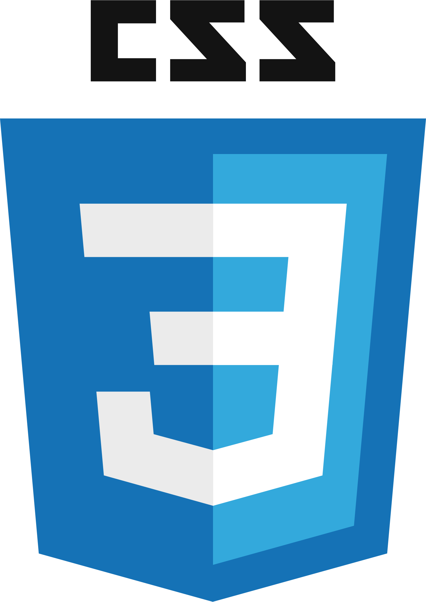
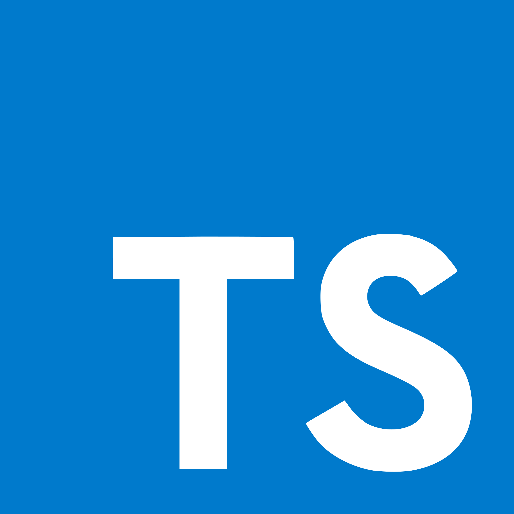
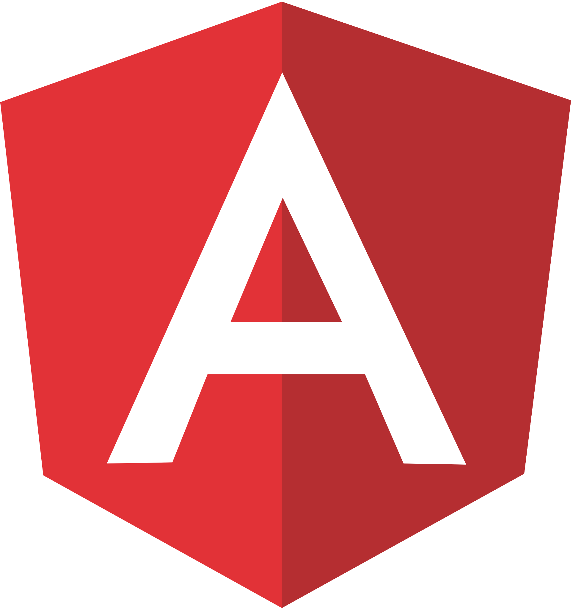

## Hi there 👋 I'm Alex

<!--
**alexjmiller5/alexjmiller5** is a ✨ _special_ ✨ repository because its `README.md` (this file) appears on your GitHub profile.

Here are some ideas to get you started:

- 🔭 I’m currently working on ...
- 🌱 I’m currently learning ...
- 👯 I’m looking to collaborate on ...
- 🤔 I’m looking for help with ...
- 💬 Ask me about ...
- 📫 How to reach me: ...
- 😄 Pronouns: ...
- ⚡ Fun fact: ...
-->
## 👨‍💻 I'm a Computer Science major at Boston University's College of Arts & Sciences
 - 🔭 I’m currently working on a probability tree diagram geneator on the web
 - 🌱 I’m currently learning how to use Websockets
 - 👯 I’m looking to collaborate on any project
 - 💬 Ask me about anything!
 - ⚡ Fun fact: I am an identical twin!
 - 📫 How to reach me: 98389659+alexjmiller5@users.noreply.github.com

## :email: Find me on:  

 
 
  

  

## 🧰 Languages and Tools:

  

## :trophy: My Github Stats:

 

<!---
- 👋 Hi, I’m @alexjmiller5
- 👀 I’m interested in computer science!
- 🌱 I’m currently learning at Boston University!
- 💞️ I’m looking to collaborate on lots of projects!
- 📫 How to reach me: alexjmil@bu.edu
--->
<!---
alexjmiller5/alexjmiller5 is a ✨ special ✨ repository because its `README.md` (this file) appears on your GitHub profile.
You can click the Preview link to take a look at your changes.
--->
